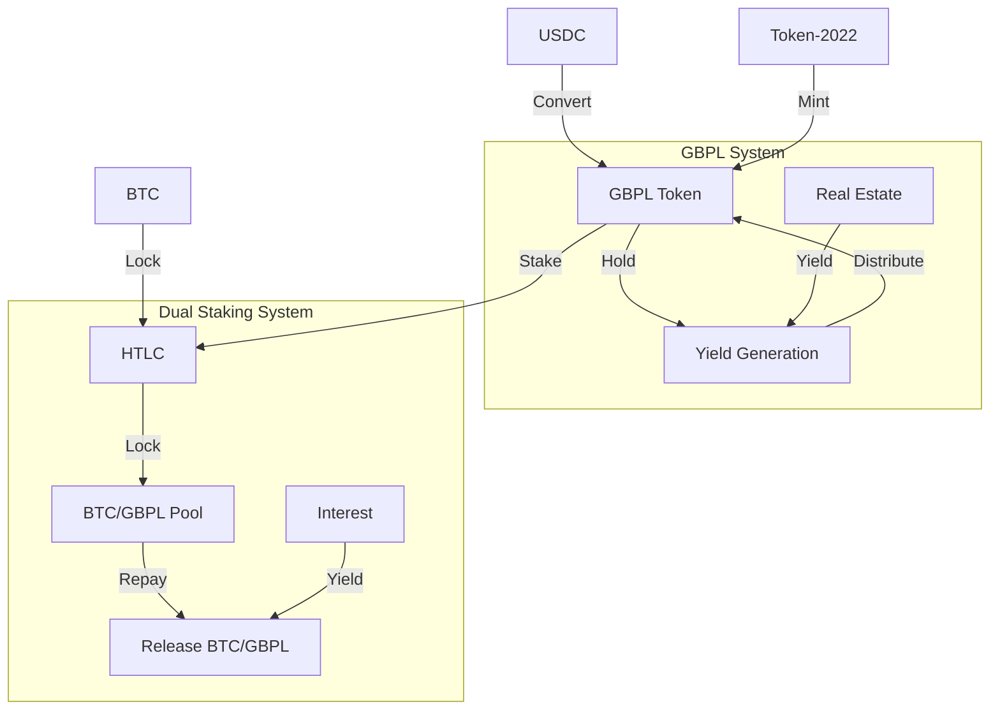
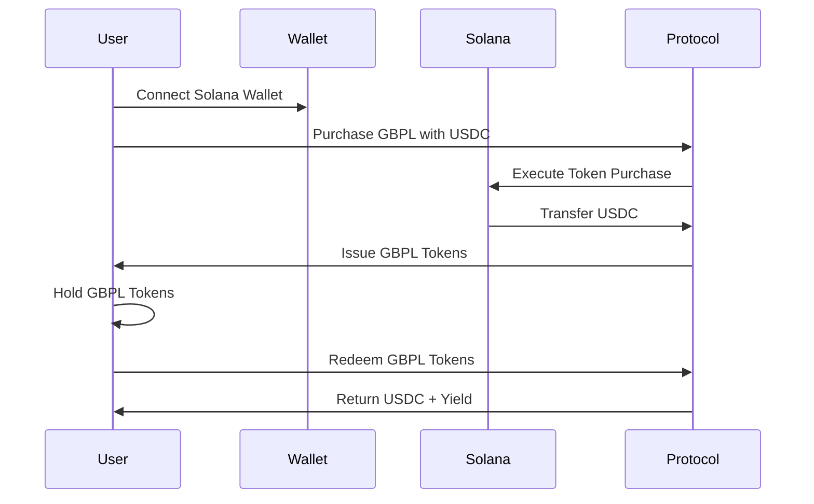
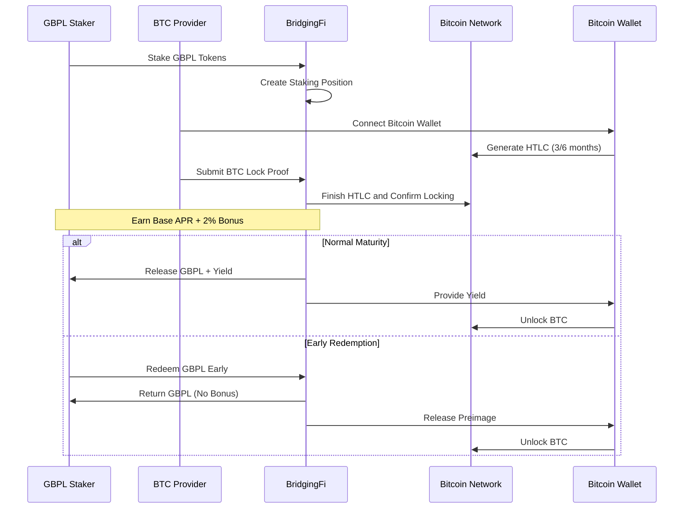

# BridgingFi Solana Demo

## Project Overview

BridgingFi is an RWA (Real World Asset) protocol that brings property-backed lending on-chain, connecting idle crypto capital, especially Bitcoin, with high-yield, short-term real estate loans in the UK. This is a demo project built for the [Colosseum Cypherpunk Hackathon](https://www.colosseum.com/cypherpunk).

**Live Demo**: [https://bridgingfi-solpunk.vercel.app](https://bridgingfi-solpunk.vercel.app)

## System Overview

### 1. GBPL Token System

**Overview**: A yield-bearing token system built using Token-2022 that allows users to purchase GBPL tokens with USDC and earn yield through real estate lending activities.

**Key Features**:

- **GBPL Token**: Yield-bearing token backed by real estate assets
- **USDC Conversion**: Easy conversion between USDC and GBPL tokens
- **Yield Generation**: Users earn yield through real estate lending activities
- **Token Management**: Purchase, redeem, and track GBPL token balances
- **Dynamic Pricing**: Daily price updates based on APR and underlying real estate performance

**User Flow**:

1. Connect Solana wallet (Phantom, Solflare, etc.)
2. Purchase GBPL tokens using USDC
3. Hold GBPL tokens to earn yield from real estate lending
4. Redeem GBPL tokens back to USDC when needed
5. Yield is distributed through the protocol's lending activities

### 2. BTC Dual Staking Protocol

**Overview**: A secure dual staking system that allows users to stake GBPL tokens and lock Bitcoin together to earn enhanced yields through HTLC (Hash Time-Locked Contracts).

**Key Features**:

- **Dual Staking**: Stake GBPL tokens and lock BTC for enhanced yields
- **HTLC Implementation**: Uses Hash Time-Locked Contracts for secure BTC locking
- **Cross-chain Security**: BTC remains on Bitcoin network, controlled via cryptographic preimage
- **Time Locks**: Supports 3-month and 6-month lock periods
- **Bonus APR**: Additional +2% APR for dual staking participants
- **Risk Management**: Clear risk management rules for early redemption

**User Flow**:

1. **GBPL Staking**: Stake GBPL tokens to participate in dual staking
2. **BTC Locking**: Lock Bitcoin using HTLC for the selected time period
3. **Enhanced Yields**: Earn base APR + 2% bonus APR for dual participation
4. **Maturity**: Both GBPL and BTC unlock automatically at maturity
5. **Early Redemption**: GBPL holders can redeem early (loses bonus APR, BTC unlocks immediately)
6. **Secure Release**: BTC automatically unlocks after time lock expires

## Technical Architecture

### Core Components



### Tech Stack

- **Blockchain**: Solana
- **SDK**: @solana/kit (Modern Solana SDK)
- **Token Protocol**: Token-2022 (Advanced Token Program)
- **Deployment**: TypeScript Scripts + CLI
- **Frontend Framework**: React 18 + TypeScript
- **Cross-chain**: HTLC for Bitcoin integration
- **Wallet Integration**:
  - Solana: Phantom, Solflare, and other Solana wallets
  - Bitcoin: Dynamic Labs Bitcoin wallet connectors

## User Flows

### GBPL Token Flow



### BTC Dual Staking Flow



## Project Structure

```
solpunk/
├── api/                # Vercel api endpoints
├── scripts/            # TypeScript deployment and utility scripts
├── src/                # Frontend source code
├── env.example         # Example env file
├── index.html          # Frontend entry point
├── README.md           # Project documentation
├── .nvmrc              # Node.js version configuration
├── vite.config.ts      # Vite configuration
```

## 🚀 Quick Start

### Prerequisites

- Node.js v22.19.0 (use `.nvmrc` file)
- pnpm package manager
- Vercel account and KV store (For API endpoints)
- Dynamic account (For Bitcoin Connector SDK)
- Solana wallet (Phantom, Solflare, etc.)
- Bitcoin wallet (for dual staking feature)

### Deployment Commands

```bash
# Deploy to devnet (for testing)
pnpm run create:mint
```

### Start the Frontend (Vercel)

```bash
# Install dependencies
pnpm install

# Start development server
pnpm run vercel:dev
```

This command launches the frontend locally for UI development (default: http://localhost:3000).

## References

- [Solana Documentation](https://solana.com/docs)
- [SPL Token Documentation](https://spl.solana.com/token)
- [Bitcoin HTLC Documentation](https://en.bitcoin.it/wiki/Hash_Time_Locked_Contracts)
- [Colosseum Cypherpunk Hackathon](https://www.colosseum.com/cypherpunk)

## Contact

For technical questions or clarifications:

- GitHub Issues
- Telegram: https://t.me/BridgingFi_Community
- Email: contact at bridging.fi
