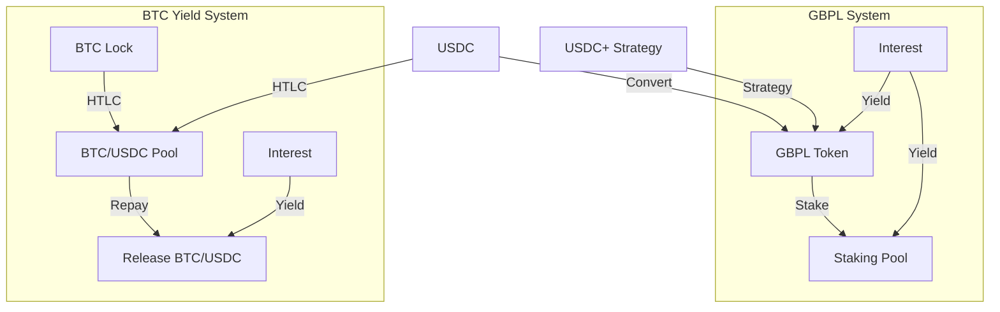
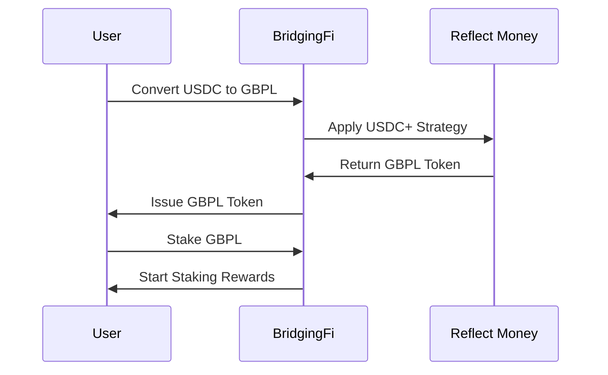
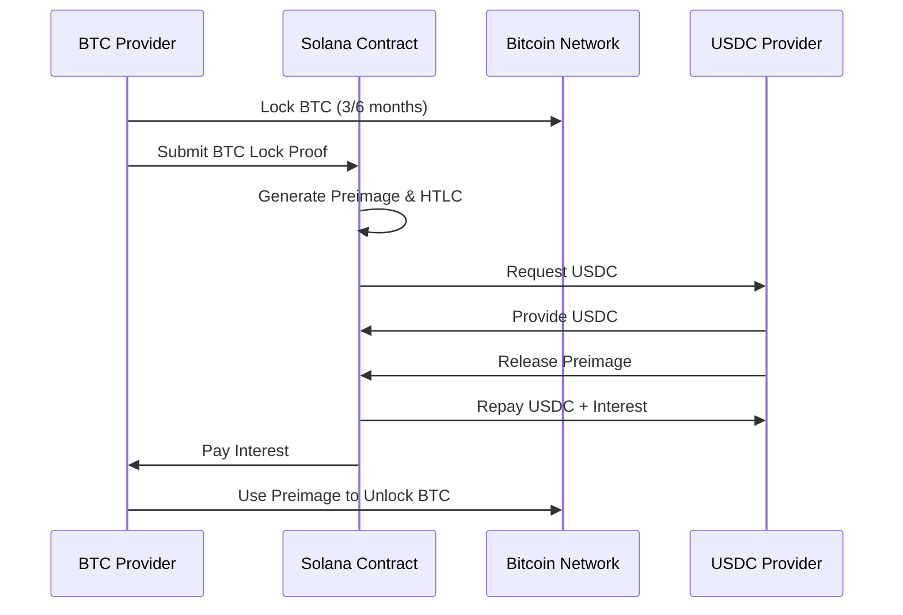

# BridgingFi Solana Demo

## Project Overview

BridgingFi is an RWA (Real World Asset) protocol that brings property-backed lending on-chain, connecting idle crypto capital, with high-yield, short-term real estate loans in the UK. This is a demo project built for the [Colosseum Cypherpunk Hackathon](https://www.colosseum.com/cypherpunk).

## System Overview

### 1. GBPL Token and Staking System

**Overview**: A yield-bearing token system that allows users to convert USDC to GBPL and earn rewards through staking.

**Key Features**:

- **GBPL Token**: Built using Reflect Money's USDC+ strategy for automatic yield generation
- **Staking Mechanism**: Users can stake GBPL tokens to earn additional rewards
- **Reward Distribution**: Dynamic reward calculation based on staking duration and amount
- **Simple Integration**: Leverages Reflect Money's proven infrastructure

**User Flow**:

1. Convert USDC to GBPL tokens
2. Stake GBPL tokens in the staking pool
3. Earn rewards from both Reflect Money's USDC+ strategy and staking bonuses
4. Claim rewards at any time

### 2. BTC Yield Protocol

**Overview**: A secure system that allows users to lock Bitcoin with other users providing USDC to earn interest together.

**Key Features**:

- **HTLC Implementation**: Uses Hash Time-Locked Contracts for secure BTC locking
- **Cross-chain Security**: BTC remains on Bitcoin network, controlled via cryptographic preimage
- **Time Locks**: Supports 3-month and 6-month lock periods
- **Preimage Control**: BTC can only be unlocked with the correct preimage

**User Flow**:

1. **BTC Providers**: Lock BTC on Bitcoin network, earn yield on Solana
2. **USDC Providers**: Provide USDC to the protocol, earn interest
3. **Repayment**: Provider releases preimage to get USDC + interest and unlocks BTC
4. **Emergency Release**: BTC automatically unlocks after time lock expires

## Technical Architecture

### Core Components



### Tech Stack

- **Blockchain**: Solana
- **Stablecoin Protocol**: Reflect Money (@reflectmoney/stable.ts)
- **Cross-chain**: HTLC
- **Frontend**: Lit/Vercel
- **Wallet Integration**: Phantom, Solflare

## User Flows

### GBPL Staking Flow



### BTC Lending Flow



## Project Structure

```
solpunk/
├── contracts/          # Solana Programs
├── frontend/           # Frontend
├── tests/              # Test Files
```

## References

- [Reflect Money Documentation](https://reflect.money/)
- [Reflect SDK](https://www.npmjs.com/package/@reflectmoney/stable.ts)
- [Solana Program Library](https://spl.solana.com/)
- [Colosseum Cypherpunk Hackathon](https://www.colosseum.com/cypherpunk)

## Contact

For technical questions or clarifications:

- GitHub Issues
- Telegram: https://t.me/BridgingFi_Community
- Email: contact at bridging.fi
