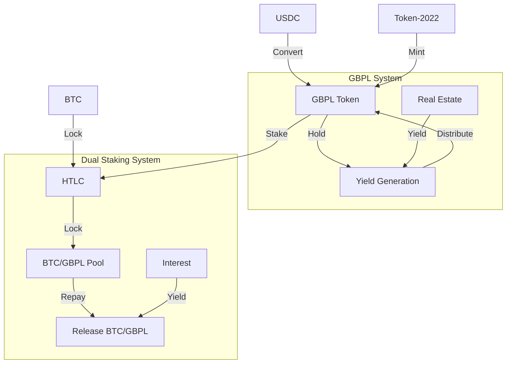
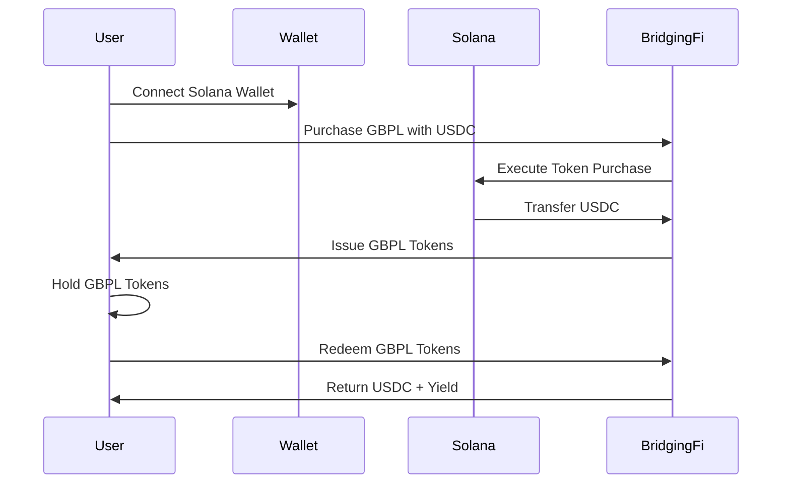
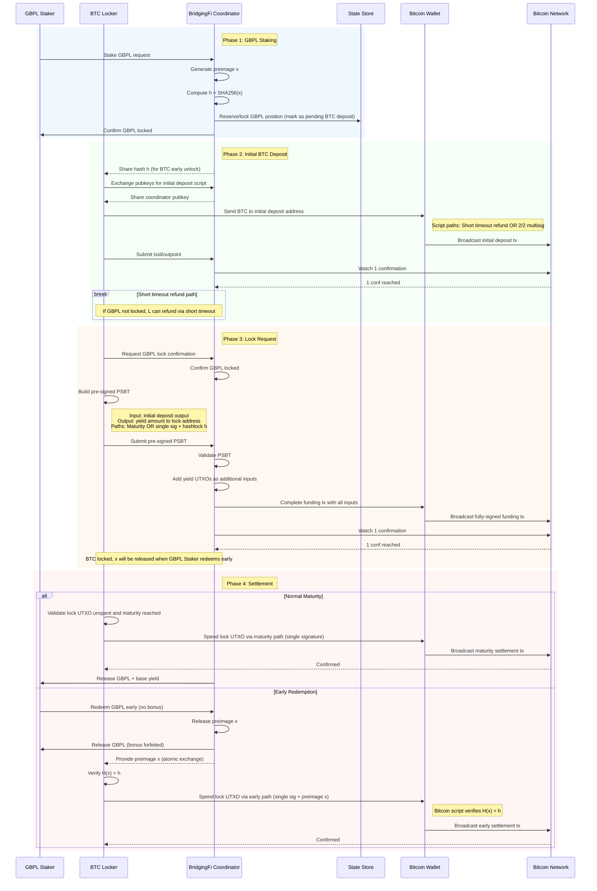

# BridgingFi Solana Demo

## Project Overview

BridgingFi is an RWA (Real World Asset) protocol that brings property-backed lending on-chain, connecting idle crypto capital, especially Bitcoin, with high-yield, short-term real estate loans in the UK. This is a demo project built for the [Colosseum Cypherpunk Hackathon](https://www.colosseum.com/cypherpunk).

**Live Demo**: [https://bridgingfi-solpunk.vercel.app](https://bridgingfi-solpunk.vercel.app)

## System Overview

### 1. GBPL Token System

**Overview**: A yield-bearing token system built using Token-2022 that allows users to purchase GBPL tokens with USDC and earn yield through real estate lending activities.

**Key Features**:

- **GBPL Token**: Yield-bearing token backed by real estate assets
- **USDC Conversion**: Easy conversion between USDC and GBPL tokens
- **Yield Generation**: Users earn yield through real estate lending activities
- **Token Management**: Purchase, redeem, and track GBPL token balances
- **Dynamic Pricing**: Daily price updates based on APR and underlying real estate performance

**User Flow**:

1. Connect Solana wallet (Phantom, Solflare, etc.)
2. Purchase GBPL tokens using USDC
3. Hold GBPL tokens to earn yield from real estate lending
4. Redeem GBPL tokens back to USDC when needed
5. Yield is distributed through the protocol's lending activities

### 2. BTC Dual Staking Protocol

**Overview**: A secure dual staking system that allows users to stake GBPL tokens and lock Bitcoin together to earn enhanced yields through HTLC (Hash Time-Locked Contracts).

**Key Features**:

- **Dual Staking**: Stake GBPL tokens and lock BTC for enhanced yields
- **HTLC Implementation**: Uses Hash Time-Locked Contracts for secure BTC locking
- **Cross-chain Security**: BTC remains on Bitcoin network, controlled via cryptographic preimage reveal
- **Time Locks**: Supports 3-month and 6-month lock periods
- **Bonus APR**: Additional +2% APR for dual staking participants
- **Risk Management**: Clear risk management rules for early redemption

**User Flow**:

1. **GBPL Staking**: Stake GBPL tokens to participate in dual staking
2. **BTC Locking**: Lock Bitcoin using HTLC for the selected time period
3. **Enhanced Yields**: Earn base APR + 2% bonus APR for dual participation
4. **Maturity**: Both GBPL and BTC unlock automatically at maturity
5. **Early Redemption**: GBPL holders can redeem early (loses bonus APR). When GBPL Staker redeems early, Coordinator releases preimage `x` to BTC Locker, enabling BTC Locker to unlock BTC immediately using the preimage
6. **Secure Release**: BTC unlocks automatically after time lock expires (maturity path), or can be unlocked early using preimage `x` when GBPL Staker redeems early

## Technical Architecture

### Core Components



### Tech Stack

- **Blockchain**: Solana
- **SDK**: @solana/kit (Modern Solana SDK)
- **Token Protocol**: Token-2022 (Advanced Token Program)
- **Deployment**: TypeScript Scripts + CLI
- **Frontend Framework**: React 18 + TypeScript
- **Cross-chain**: HTLC for Bitcoin integration
- **Wallet Integration**:
  - Solana: Phantom, Solflare, and other Solana wallets
  - Bitcoin: Dynamic Labs Bitcoin wallet connectors

## User Flows

### GBPL Token Flow



### BTC Dual Staking Flow



### HTLC — Technical Design

This hackathon phase uses a centralized coordinator to manage a standard HTLC (Hash Time-Locked Contract) flow without a Solana program. The design uses pre-signed PSBTs to avoid wallet conflicts, with dual-path scripts enabling both time-locked refunds and hashlock-based early unlocks. BTC is locked using standard Bitcoin HTLC scripts with hashlock and timelock paths, following the classic atomic swap pattern described in [Bitcoin Wiki](https://en.bitcoin.it/wiki/Atomic_swap). The atomic exchange is achieved through preimage reveal: Coordinator generates preimage `x` and shares hash `h = SHA256(x)` with BTC Locker in Phase 2. When GBPL Staker requests early redemption in Phase 4, Coordinator releases preimage `x` to BTC Locker, enabling BTC Locker to unlock BTC early. In the future, this can be upgraded to a decentralized Solana program and LN-style channel implementation for stronger security guarantees and reduced interaction rounds.

#### Entities

- BTC Locker: The user who locks BTC into an HTLC
- GBPL Staker: The user who stakes GBPL for enhanced yield (can be the same as Locker)
- Centralized Coordinator (BridgingFi): Coordination layer for the hackathon
- State Store: Durable storage for intents and transitions
- Bitcoin Wallet/Network: On-chain settlement for BTC

#### Notation

- x: 32-byte preimage generated by BridgingFi Coordinator (for early unlock)
- h = SHA256(x): Hash for Bitcoin script hashlock verification (lock address early unlock path)
- T_short: Short timeout for initial deposit refund (if GBPL not locked)
- T_maturity: Absolute CLTV locktime at 3 or 6 months for lock address
- Confirmation: 1 confirmation (demo)
- Initial Deposit UTXO: BTC sent to address with short timeout OR 2/2 multisig paths
- Lock UTXO: Final locked BTC with yield amount, paths: maturity OR single sig + preimage x

#### Security Rationale

This design ensures security through:

1. **Atomic exchange via preimage reveal**: Following the classic atomic swap pattern ([Bitcoin Wiki](https://en.bitcoin.it/wiki/Atomic_swap)), Coordinator generates preimage `x` and shares hash `h = SHA256(x)` with BTC Locker in Phase 2. When GBPL Staker requests early redemption in Phase 4, Coordinator releases preimage `x` to BTC Locker, enabling BTC Locker to unlock BTC early. This ensures atomic exchange: when GBPL Staker redeems early, Coordinator must release `x` for BTC Locker to unlock funds. If GBPL Staker does not redeem early, BTC Locker can unlock via maturity path after timelock expires.

2. **Bitcoin script hashlock verification**: SHA256 hash `h = SHA256(x)` is used for Bitcoin HTLC script hashlock verification. Bitcoin script verifies `H(x) = h` before allowing fund withdrawal, ensuring only the party with the correct preimage can unlock funds.

3. **Dual-path scripts with timelocks**: Initial deposit script provides a short timeout refund path if GBPL staking fails, protecting BTC Locker. Lock address script provides both maturity path (single signature after CLTV) and early unlock path (single signature + preimage x), giving BTC Locker control while enabling early redemption when GBPL Staker requests it.

4. **Verification gates**: Preimage is verified via hash check (`H(x) = h`) for Bitcoin script validation, ensuring data integrity and atomic exchange.

#### Future Upgrades

This centralized coordinator approach can be upgraded to:

- **Decentralized Solana Program**: Enforce HTLC script verification and atomic exchange on-chain for stronger security guarantees
- **LN-style Channel Implementation**: Leverage commitment channels and penalty mechanisms similar to Lightning Network for reduced interaction rounds and improved scalability, while maintaining the dual staking functionality

## Project Structure

```
solpunk/
├── api/                # Vercel api endpoints
├── scripts/            # TypeScript deployment and utility scripts
├── src/                # Frontend source code
├── env.example         # Example env file
├── index.html          # Frontend entry point
├── README.md           # Project documentation
├── .nvmrc              # Node.js version configuration
├── vite.config.ts      # Vite configuration
```

## 🚀 Quick Start

### Prerequisites

- Node.js v22.19.0 (use `.nvmrc` file)
- pnpm package manager
- Vercel account and KV store (For API endpoints)
- Dynamic account (For Bitcoin Connector SDK)
- Solana wallet (Phantom, Solflare, etc.)
- Bitcoin wallet (for dual staking feature)

### Deployment Commands

```bash
# Deploy to devnet (for testing)
pnpm run create:mint
```

### Start the Frontend (Vercel)

```bash
# Install dependencies
pnpm install

# Start development server
pnpm run vercel:dev
```

This command launches the frontend locally for UI development (default: http://localhost:3000).

## References

- [Solana Documentation](https://solana.com/docs)
- [SPL Token Documentation](https://spl.solana.com/token)
- [Bitcoin HTLC Documentation](https://en.bitcoin.it/wiki/Hash_Time_Locked_Contracts)
- [Colosseum Cypherpunk Hackathon](https://www.colosseum.com/cypherpunk)

## Contact

For technical questions or clarifications:

- GitHub Issues
- Telegram: https://t.me/BridgingFi_Community
- Email: contact at bridging.fi
