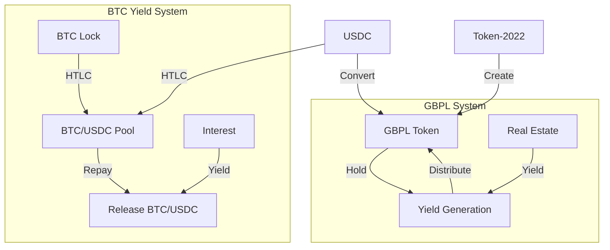
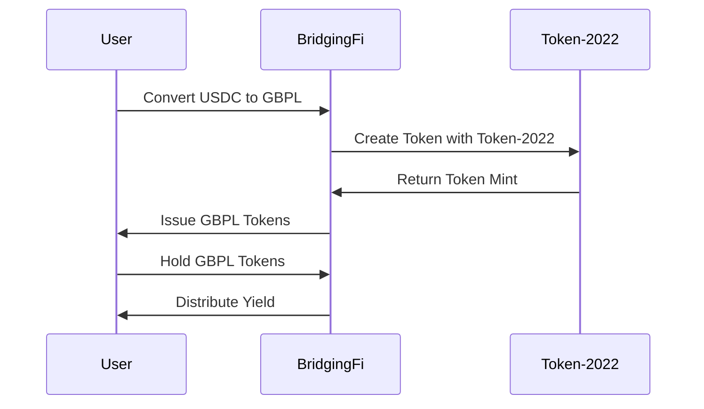
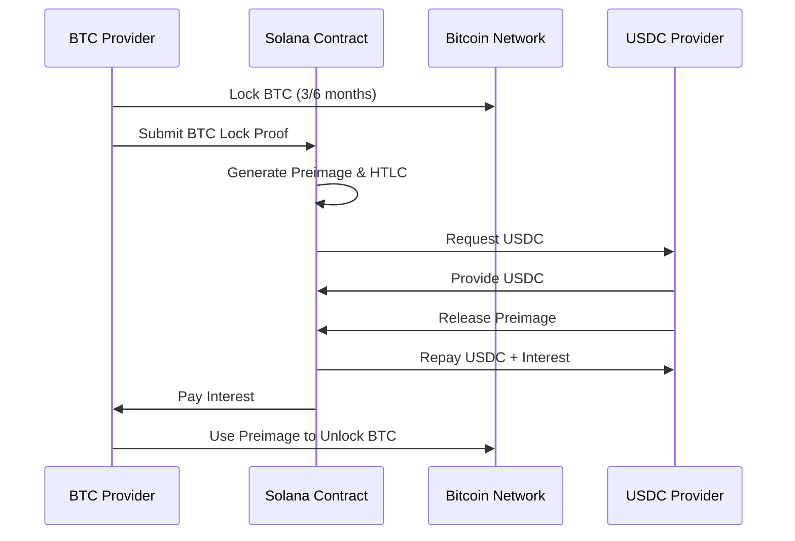

# BridgingFi Solana Demo

## Project Overview

BridgingFi is an RWA (Real World Asset) protocol that brings property-backed lending on-chain, connecting idle crypto capital, with high-yield, short-term real estate loans in the UK. This is a demo project built for the [Colosseum Cypherpunk Hackathon](https://www.colosseum.com/cypherpunk).

**Live Demo**: [https://bridgingfi-solpunk.vercel.app](https://bridgingfi-solpunk.vercel.app)

## System Overview

### 1. GBPL Token System

**Overview**: A yield-bearing token system built using Token-2022 that allows users to mint GBPL tokens and earn yield through real estate lending.

**Key Features**:

- **GBPL Token**: Built using Token-2022 for advanced token functionality
- **Yield Generation**: Users earn yield through real estate lending activities
- **Simple Minting**: Easy token minting and burning functionality
- **Advanced Features**: Token-2022 supports transfer fees, permanent delegates, and more
- **Future-Proof**: Latest Solana token standard with enhanced capabilities

**User Flow**:

1. Convert USDC to GBPL tokens (using Token-2022)
2. Hold GBPL tokens to earn yield from real estate lending
3. Convert GBPL back to USDC when needed (using Token-2022 burning)
4. Yield is distributed through the protocol's lending activities

### 2. BTC Yield Protocol

**Overview**: A secure system that allows users to lock Bitcoin with other users providing USDC to earn interest together.

**Key Features**:

- **HTLC Implementation**: Uses Hash Time-Locked Contracts for secure BTC locking
- **Cross-chain Security**: BTC remains on Bitcoin network, controlled via cryptographic preimage
- **Time Locks**: Supports 3-month and 6-month lock periods
- **Preimage Control**: BTC can only be unlocked with the correct preimage

**User Flow**:

1. **BTC Providers**: Lock BTC on Bitcoin network, earn yield on Solana
2. **USDC Providers**: Provide USDC to the protocol, earn interest
3. **Repayment**: Provider releases preimage to get USDC + interest and unlocks BTC
4. **Emergency Release**: BTC automatically unlocks after time lock expires

## Technical Architecture

### Core Components



### Tech Stack

- **Blockchain**: Solana
- **SDK**: @solana/kit (Modern Solana SDK)
- **Token Protocol**: Token-2022 (Advanced Token Program)
- **Deployment**: TypeScript Scripts + CLI
- **Frontend**: HTML/CSS/JavaScript
- **Cross-chain**: HTLC
- **Wallet Integration**: Phantom, Solflare

## User Flows

### GBPL Token Flow



### BTC Lending Flow



## Project Structure

```
solpunk/
├── scripts/            # TypeScript deployment and utility scripts
├── src/                # Frontend source code
├── index.html          # Frontend entry point
├── README.md           # Project documentation
├── .nvmrc              # Node.js version configuration
├── vite.config.ts      # Vite configuration
```

## 🚀 Quick Start

### Prerequisites

- Node.js v22.19.0 (use `.nvmrc` file)
- pnpm package manager

### Deployment Commands

```bash
# Deploy to devnet (for testing)
pnpm run create:mint
```

### Start the Frontend (Vite)

```bash
pnpm run dev
```

This command launches the frontend locally for UI development (default: http://localhost:5173).

## References

- [Solana Documentation](https://solana.com/docs)
- [SPL Token Documentation](https://spl.solana.com/token)
- [Solana CLI Documentation](https://docs.solana.com/cli)
- [Colosseum Cypherpunk Hackathon](https://www.colosseum.com/cypherpunk)

## Contact

For technical questions or clarifications:

- GitHub Issues
- Telegram: https://t.me/BridgingFi_Community
- Email: contact at bridging.fi
